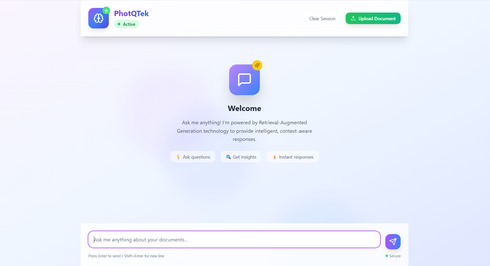
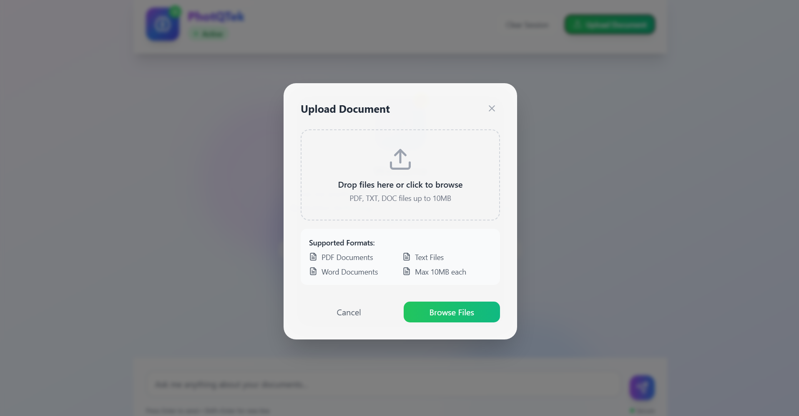
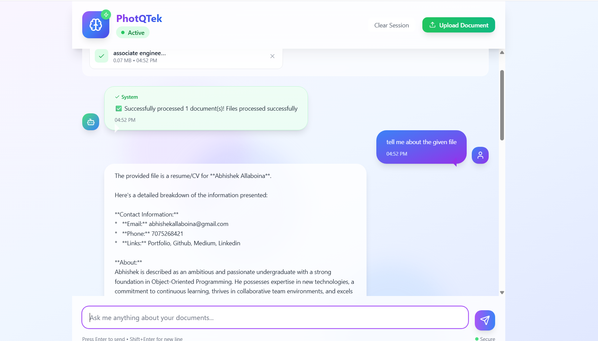

# DOC:RAG - AI-Powered Document Analysis and Chat

PhotQTek is a modern web application that combines the power of Google's Gemini AI with document analysis capabilities. It allows users to upload various types of documents and chat with an AI assistant that can understand and answer questions based on the document content.

# DEMO





## Features

- 📄 **Multi-Format Document Support**
  - PDF Documents
  - Word Documents (DOCX)
  - Text Files (TXT)
  - Spreadsheets (CSV, XLSX)
  - PowerPoint Presentations (PPT, PPTX)
  - Images (JPG, JPEG, PNG, GIF, BMP, WEBP)

- 🤖 **AI-Powered Analysis**
  - Document text extraction
  - Image content analysis using Gemini Vision
  - Intelligent question answering
  - Context-aware responses
  - Fallback to general chat when context is insufficient

- 💻 **Modern Web Interface**
  - Responsive design
  - Real-time chat interface
  - Drag-and-drop file upload
  - Beautiful animations and transitions
  - Connection status monitoring

## Prerequisites

- Python 3.8 or higher
- Google API Key for Gemini AI
- Modern web browser

## Installation

1. Clone the repository:
```bash
git clone <repository-url>
cd <repository-name>
```

2. Install required Python packages:
```bash
pip install flask flask-cors PyPDF2 python-docx pandas langchain langchain-google-genai google-generativeai python-pptx Pillow python-dotenv
```

3. Create a `.env` file in the project root and add your Google API key:
```
GOOGLE_API_KEY=your_google_api_key_here
```

## Running the Application

1. Start the Flask server:
```bash
python app.py
```

2. Open your web browser and navigate to:
```
http://localhost:8000
```

## Usage

1. **Upload Documents**
   - Click the "Upload Document" button
   - Drag and drop files or click to browse
   - Supported formats: PDF, DOCX, TXT, CSV, XLSX, PPT, PPTX, Images

2. **Chat with Documents**
   - Type your question in the chat input
   - Press Enter or click the send button
   - The AI will analyze the documents and provide relevant answers

3. **Features**
   - Real-time document processing
   - Context-aware responses
   - Fallback to general chat when needed
   - Connection status monitoring
   - Clear session option

## Technical Details

### Backend (Flask)
- RESTful API endpoints
- CORS support for cross-origin requests
- Document processing and text extraction
- Vector store for efficient document search
- Integration with Google's Gemini AI

### Frontend
- Modern UI with Tailwind CSS
- Responsive design
- Real-time updates
- Error handling and user feedback
- File upload with drag-and-drop support

## API Endpoints

- `GET /` - Serve the main application
- `GET /health` - Health check endpoint
- `POST /upload-files` - Upload and process documents
- `POST /ask-question` - Ask questions about uploaded documents

## Error Handling

The application includes comprehensive error handling for:
- File upload issues
- Document processing errors
- API connection problems
- Invalid file formats
- Missing or invalid API keys

## Security

- CORS protection
- Secure file handling
- Environment variable management
- Input validation
- Error message sanitization

## Contributing

Contributions are welcome! Please feel free to submit a Pull Request.

## License

This project is licensed under the MIT License - see the LICENSE file for details.

## Acknowledgments

- Google Gemini AI for providing the AI capabilities
- LangChain for document processing
- Flask for the backend framework
- Tailwind CSS for the frontend styling